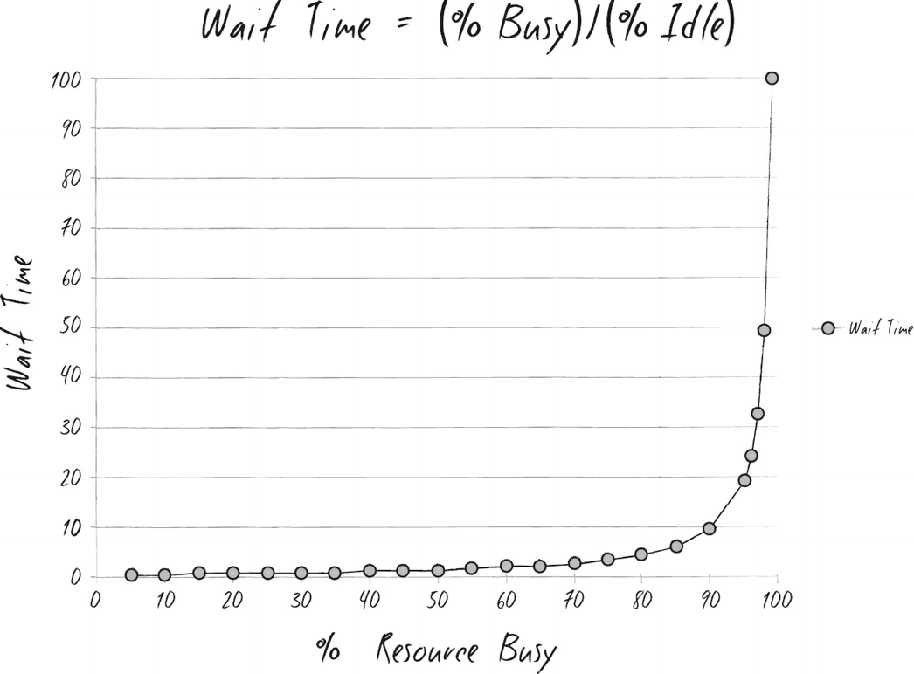
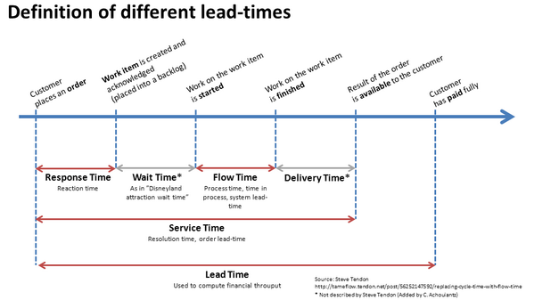
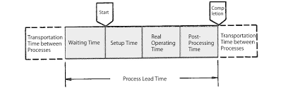

**Work in progress**

## Source of the confusion

When reading the novel book on software development, Phoenix Project, one formula kept popping up and caused an enduring confusion in me.

This is the chart I take directly from the book. It's involved in a discussion about how to improve the wait time of IT operation requests.

> "The wait time is the ‘percentage of time busy’ divided by the ‘percentage of time idle.’ In other words, if a resource is fifty percent busy, then it’s fifty percent idle. The wait time is fifty percent divided by fifty percent, so one unit of time. Let’s call it one hour. So, on average, our task would wait in the queue for one hour before it gets worked. “On the other hand, if a resource is ninety percent busy, the wait time is ‘ninety percent divided by ten percent’, or nine hours. In other words, our task would wait in queue nine times longer than if the resource were fifty percent idle.”
>
>Kim, Gene. The Phoenix Project (p. 303). IT Revolution Press. Kindle Edition. 

My first impression then was that, how come a lower utilization would increase performance? And why does a less than one-fold increase in utilization boast the wait time by 9 times?

## Short conclusion

For the first impression, the answer is, lower utilization wouldn't improve the common perception of performance. I confused 'wait time' as the only factor of the performance. Actually, a lower utilization decrease wait time at the cost of a worse throughput, which is defined as amount of tasks finished in a fixed period of time.

It's better to introduce a definition of all components in lead time now.

As we can see, a lower wait time should decrease lead time, therefore improve throughput. The missing part here is in the method to decrease utilization. If the flow time (actual time spent on a task) is the same, the number of resources is the time, the only mutable part in calculating utilization is the amount of total tasks.

**In other words, to decrease utilization, to improve wait time, we need to decrease the total assigned tasks in the time period.**

So wait time is a trade off of throughput. In manufacturing, high wait time leads to higher inventory. In software industry, high wait time leads to slower feature delivery. Bear in mind, faster doesn't mean more.

The answer for the ninefold wait time is simple: it's math.

## Long journey

In the process of solving the confusion, I went through the origin of formula in mathematics, it's implication in manufacturing, and what it means for software project management.

This formula works in the scenario that only one resource, one queue is involved.

## In context of queue theory

The Kingman Formula
Queue Theory
G-G-1 Queue

Restaurant service queue

## In context of manufacturing

- Multiple resources

## In context of software project management

- Not all tasks are mandatory
- Counterpart of Arrival
- Counterpart of Service
- Role of unplanned work

## References

- The Kingman Formula – Variation, Utilization, and Lead Time <https://www.allaboutlean.com/kingman-formula/>
