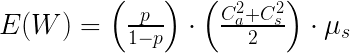

## Source of the confusion

When reading the novel book on software development, Phoenix Project, one formula kept popping up and caused an enduring confusion in me.

This is the chart I take directly from the book. It's involved in a discussion about how to improve the wait time of IT operation requests.

> "The wait time is the ‘percentage of time busy’ divided by the ‘percentage of time idle.’ In other words, if a resource is fifty percent busy, then it’s fifty percent idle. The wait time is fifty percent divided by fifty percent, so one unit of time. Let’s call it one hour. So, on average, our task would wait in the queue for one hour before it gets worked. “On the other hand, if a resource is ninety percent busy, the wait time is ‘ninety percent divided by ten percent’, or nine hours. In other words, our task would wait in queue nine times longer than if the resource were fifty percent idle.”
>
>Kim, Gene. The Phoenix Project (p. 303). IT Revolution Press. Kindle Edition. 

My first impression then was that, how come a lower utilization would increase performance? And why does a less than one-fold increase in utilization boast the wait time by 9 times?

## Short conclusion

For the first impression, the answer is, lower utilization wouldn't improve the common perception of performance. I confused 'wait time' as the only factor of the performance. Actually, a lower utilization decrease wait time at the cost of throughput, which is defined as amount of tasks finished in a fixed period of time.

It's better to introduce a definition of all components in lead time before going furthur.

As per the definition, a lower wait time should decrease lead time, therefore improve throughput. The missing part here is in the method to decrease utilization. If the flow time (actual time spent on a task) is the same, the number of resources is the same as well, then the only mutable part in utilization is the amount of processed tasks. 

**In other words, to decrease utilization, to improve wait time, we need to decrease the total assigned tasks in the time period.**

So wait time is a trade off of throughput. In manufacturing, high wait time leads to higher inventory. In software industry, high wait time leads to slower feature delivery. Bear in mind, faster doesn't mean more.

The answer for the ninefold wait time is simple: it's math.

## Long journey

In the process of solving the confusion, I went through the origin of formula in mathematics, it's implication in manufacturing, and what it means for software project management.

### In the context of queue theory

The formula in question stems from Kingman's formula, 'is an approximation for the mean waiting time in a G/G/1 queue'. 'The formula is the product of three terms which depend on utilization (U), variability (V) and service time (T).'

> **Queue**: Picture this as a fast food counter. One attendant, one queue.
>
> **G/G/1 queue**: A queue with a general distribution of arrival time and a general distribution of servicing time. General distribution means the details of arrival time and service time are uncertain, all we know is the mean value and variation.
>
> **E(W)**: The expectation of wait time. In layman's term, the average wait time of all customers in question.
>
> **p**: Utilization, busy time divided by all time
>
> $C_a,C_s$: The coefficient of variation for the arrival and servicing. It's calculated by dividing the variation time with mean time.
>
> $\mu_s$: Mean time of service.

This article is well written, I got most of the knowledge on the formula from it: [The Kingman Formula – Variation, Utilization, and Lead Time](https://www.allaboutlean.com/kingman-formula). There is an example with real numbers and several diagrams showcasing the impact of the factors in formula.

My own takeaway from the formula is the cause of wait time: **variation**. If all customers come in a fixed cadence and the attendant serve each customer within same time, there won't be a wait time at all.

So the redundancy in utilization is reserved for variation in both arrivals and services.

The first fragment in formula explains why wait time increase in quadratic relation to utilization.

Finally, let's check all the factors to see how to improve the wait time of a fast food restaurant:

- Utilization: Recruit more attendants or turn customers away.
- Variation: Standardize service. Flatten the arrival time, say, by discriminatory pricing based on busy hours.
- Mean service time: This is self explanatory.

### In the context of manufacturing

With the knowledge from last chapter, we can look at real cases in manufacturing.

For the whole business, the queue comes from product order. It requires sophisticated calculation and prediction to balance the investment in production capacity with the wait time of customers. Kingman's formula alone doesn't suffice for this scenario.

For one assembly line, the queue comes from releases of production requests. This is somehow controllable. A low wait time at this level would decrease inventory, thus reduce costs. The utilization of assembly line should take the level of variance in both requests and production stability (including defection, maintenance, transportation etc) into account.

For a single work center (it means one assembling station), the variation of queue stems from upstream work centers. The longer the chain, the higher the variation, the fatter the inventory.

### In the context of software project management

In software development project, especially in a Scrum project, the priority of user stories are adjusted frequently, thus lower the significance of wait time. In fact it's even not possible to calculate a meaningful wait time, it's easy to meddle with the figure by rearranging the stories or keep a story never got into sprint.

If you are familiar with the four key metrics introduced in Accelerate, you'll notice **delivery** lead time is one of them. This doesn't include design and implementation. (Page 49) It's the same scope talked about in Phoenix Project. We must bear this difference in mind.

It's more relevant when we think about a key person/resource in the team, if others in the team heavily depend on the availability of the key person, it makes sense to spread the workload and break dependencies so the wait time could be minimized. This could be achieved by knowledge sharing. Yet still, the formula is not necessary to this finding, common sense suffices.

What's unplanned work's role here? I'm not sure. It doesn't fit in the original scenario of Kingman's formula. I'll rest my case now.
