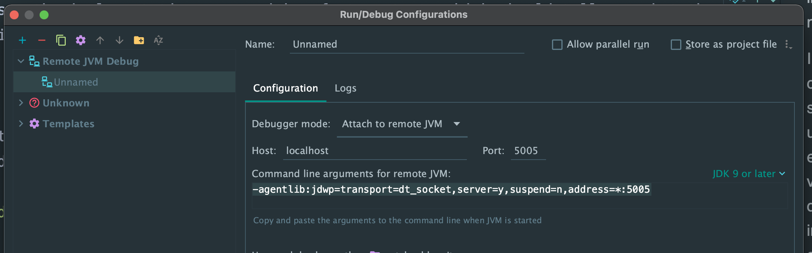

Though it's always a fancy thing to start with a greenfield, the same chances are that
we start with a codebase having been there, large or small, messy or tidy. Reading an existing
codebase could be a preparatory work before a project (as mentioned in Object-Oriented Reengineering
Patterns by Serge Demeyer), or a daily practice modifying a feature.

Either case, there are some shared tricks to make this potentially painful process a tiny bit less
frustrating. Anyway, the worst code in the world, is code written by others, sometimes including
your past ego. 

## Start with a demo

Figure out the feature or the happy path first. Don't even attempt to reveal that from 
implementation if the feature is more than a fizz buzz.

In rare case, the implementation comes with a feature test, which should tell you what the 
covered units intend to do. Nevertheless, even that could not provide the value as an end user or QA 
could demo to you. With the happy path in mind the journey into the codebase would be lots 
easier.

Not to mention the extra hints of the most valuable parts for business you could infer from
the demo, directly or indirectly.

## Have a debuggable local deployment 

As a static presentation, codebase might not provide the runtime flow which matters under some
scenarios. A debuggable deployment is a blessing. Just for the record, here are the arguments to 
enable debugging for Tomcat and feature to monitor that in IntelliJ. 

```bash
JPDA_OPTS="-agentlib:jdwp=transport=dt_socket,server=y,suspend=n,address=5006" $TOMCAT_HOME/bin/catalina.sh jpda start
```



## Identify the structure

When new to a project codebase, try to find out the frameworks it's using to quickly tell the
entrypoints or conventions. 

To mention some examples in Java world

- web.xml for all web applications. You might find the servlets or filters which are not obvious.
- Annotations in Spring world, like `@Controller`, `@Service`, `@Configuration` etc.
- Spring configuration XMLs, to which the path should be mentioned in web.xml


## Global textual search

Like googling, once you figure out the right keywords, global search could really handy, be it 
endpoints' name, constants, or a snippet of HTML/JS code you catch in the frontend. That could
then serve as an anchor for further investigation.

In IntelliJ, it's presented as "Find in files", which could be brought up with "CMD/CTRL+SHIFT+F".
Make sure to familiarise yourself with that.

One of my colleague once showed me an ack-like command line source code searching tool called 
"the_silver_bullet". I don't know ack at all, let alone this new stuff, but it might be worth a 
look. Here's an example to execute it `ag -m=1 --java "<th>some nested HTML code</th>"`

## Use your IDE for your advantage

In IntelliJ, a set of features are handy in code reading. Find them in your list of actions 
(CMD/CTRL + SHIFT + A)
- Find usages
- Go to / Go to implementation
- Call hierarchies 

I strongly recommend the less known "Call hierarchies" feature for its overview of the call chains.

You really want to stay focused when exploring a strange field. Get used to using the short 
keys. Actually, I tend to use keyboards as much as I can in all daily works. 
