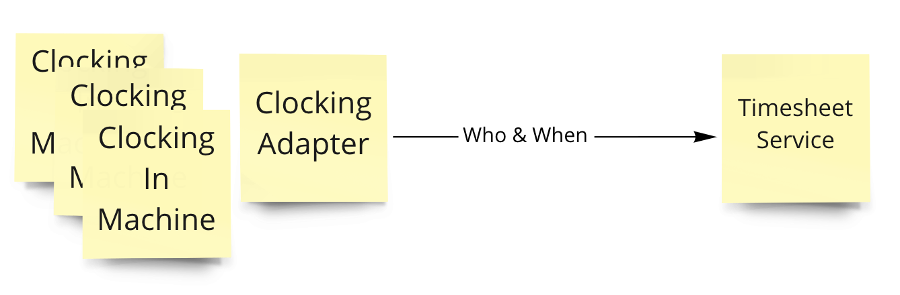

# Summary

This article is about a real case in my project to deliver a real-time feature, which relies on
distributed messaging between service boundaries. Instead of a pure technical literature on choice
of tools or coding approaches, or the principles we've heard a lot behind designing microservices'
communication, I'd like to beam the spotlight to the juxtaposition of them and how they matter in
implementing a robust, easy-to-maintain messaging. Especially, the importance of revealing business
logics in the process.

# Context

The core function of system might sound distant to most of the readers, it's to show the clocking of
employees in the client when they arrived and left the work. As the modern version, there are
so-called biometric clocking machine to identify employees by fingerprints or eyeballs. The feature
to deliver at the moment is to collect those clocking events and provide a UI to display the
clock-in and clock-out time, along with inferred worked hours among other stats following a set of
rules.

The clocking data collected by the machine are stored in a separate system whose interface is a
Microsoft SQL Server database view. The system we are building is aiming for a microservice
architecture, which is continuously deployed through pipeline.

## Glossary and business rules

- The service to provide that UI is called **Timesheet**
- The system owning the clocking data is called **Clocking**
- The earliest clocking time of the day is called **clock-in**, the latest time of the day is
  called **clock-out**
- We ensured both system have aligned on the universal identifiers for employees
- It's a local organization, so no timezone concern at the moment
- The database view **Clocking** system provided contained an auto-incremented identifier, the
  employee identifier and the timestamp of clocking

# Initial iteration

Without much hesitation, we started with a distributed messaging approach to minimise the coupling
between the systems. Since the Clocking system doesn't provide messaging capability out of the box,
we build a separately deployed **Adapter** to fetch the data from the Clocking database and send the
message. The payload is simple that only contains the identifier of the employee and a timestamp of
when the clocking happens.

## Building adapter

Under the flag of no state, so to start with the simplest design, the adapter is a 5-min interval
cron job to load clocking happened in the past 5 minutes. To avoid concurrency issue, we only deploy
one instance of this service.

Question time, what issues do you spot from this design?

## Building timesheet

Timesheet only cares about the earliest and latest clocking of the day, so it makes no sense to keep
all the history. For a second we thought of event sourcing within the service, yet it's going to
only be a clone of the data it doesn't own, which might be a bad idea. Then we came up with below
algorithm.

1. When a message arrives, check if the employee already has an **Entry** for the day
2. If no, it's the first clocking of the day, hence an Entry is created for the day and records the
   timestamp in the message as clock-in
3. If yes, that means an entry with clock-in already exists, so we would update the entry with the
   clock-out time
4. Similarly, further messages in the day would update the clock-out time until the last one
   arrives.

And yes, we have two instances of this service.

Again, question time.

## Release to production

After some _thorough_ testing in QA environment with fabricated clocking data, because the Clocking
'conveniently' doesn't have a testing environment, we released them. Almost straight away, we
noticed some wierd things happening to some employees

- Clock-in or out time was missing
- Clock-in or out time was incorrect
- Clock-out time is earlier than clock-in time

The troubleshooting wasn't a pleasant journey at all. Digging logs, adding debugging info,
scratching head, we've all been thorough this somewhere in the career.

Anyone who has some practical experience with messaging and multi-threading might have worked out
the cause

### Clock-in or out time was missing

The triggering of cron job occurs with certain degree of deviance, which we had expected before
release. The solution was to add a few extra seconds to the query to get the data. So the interval
of cron job is 5 minutes, but we request for data happened in the past 5 minutes and 15 seconds. The
potential duplicated messages would result in an entry with same clock-in and clock-out time at
certain time of the day, which would be corrected by later clock-out.

The good intention was screwed due to a bug in coding, instead of extra 15 seconds we had 15 seconds
less, which explained the missing messages. The answer was not interesting by itself, yet it
highlighted the difficulty to test the service with confidence, even we've followed TDD most of the
time. An acceptance test for a cron job won't be cost-efficient to run and maintain, so there was
none.

### Clock-in or out time was incorrect

We understood the timesheet service was not thread safe if two instances are handling messages for
the same employee at the same time. Considering it shouldn't happen a lot, we kinda played it down.

It turned out that one of the machine wasn't that sensitive to fingerprints, or some employees
simply didn't trust the beep from it. The result was that in the 5 minutes window, one employee
might have more than one clocking message, which were processed by two timesheet instances at the
same time. Due to the race condition, the consequence were too mysterious for human brain, and to be
reliably automated tested.

I reproduced the issue out of luck with bombarding local installation with messages. Yet it's not a
deterministic test fit for pipeline execution.

### Clock-out time is earlier than clock-in time

It's mostly caused by the same reason of previous one.

## Recap on the issues of first iteration

There could be some shortcuts to solve the issues, but all come with caveats:

- Add a distinct/max/min filtering for the clocking within the time window grouped by employee. The
  problem is that the adapter has no knowledge of whether it's supposed to be the clock-in or the
  clock-out, hence max or min would mistake either of the clocking time.
- Add database lock in timesheet service. No developers like this type of complexity. Usually locks
  are reserved as last resort.

To sum up, we've concluded the inherited flaw of first iteration

- Cron is not wrong by itself. The problem is that the rightness of system is closely relying on the
  stability and accuracy of cron job, which is once in a blue moon.
- It's a fallacy to call a cron-based system "stateless". Actually, you couldn't name a worse state
  than time. Having nothing persistent doesn't make a system "stateless", it has to produce same
  result for same input if no changes are made. On the contrary, you couldn't step into the same
  river twice, could you?
- We haven't even considered if the adapter service was down, how could we make up for the missing "
  time". Even we added a feature to replay the missing messages, the timesheet won't accept them
  correctly because the wrong clock-in has been carved into the stone. First come, first served.

Or put it in another way, to ensure the system behave as expected, the hidden contracts are

- Adapter is never down
- Adapter cron job's interval error is neglectable
- Employees won't clock more than once in any 5 minutes
- The clocking messages are delivered in order, under any situation

Some of them are met, some of them is simply impossible. Though the implementation looks simple, in
fact distributed messaging solution is not simple by nature. The costly hidden contracts comes with
it from the very beginning .

# Second Iteration

First breakthrough, we set up the adapter in QA environment, loading data from production clocking
system. It's not always possible in all circumstances, mostly due to security concerns. That's why
it wasn't our first option. However, if the inputs to a system are unconditioned human behaviours,
in this case not framed by system's own UI, a real time production data alike verification is a
blessing.

## Adapter

- To persist the last synced clocking's identifier. Since there's only one instance, a local file is
  good enough. The benefit of this approach has two, the timing of cron job doesn't matter more than
  the frequency of pushing messages, and a breakdown won't affect the eventual correctness.

After the changes, a review of the hidden contracts in first iteration explains where we are

- ~~Adapter is never down~~
- ~~Adapter cron job's interval error is neglectable~~
- Employees won't clock more than once in any 5 minutes
- The clocking messages are delivered in order, under any situation

## Timesheet

In a hindsight, this was the time of diminishing return. If the client accept an at most 5 minutes'
error, the third contract won't exist. Nevertheless, it would be awkward to explain why. Thanks to
the changes on adapter, the last contract would almost be met as long as we never had to replay
messages from the past.

Anyway, we kept moving on. The next stride was to make the service idempotent, which later proved to
be indispensable in our messaging model. Until very recently have I realised, the pattern that the
series of clocking events being squeezed into two fields, is a **map-reduce**. A quick search would
explain why idempotency is necessary.

What I'd like to cover here, is how idempotency is achieved in this case. This is highly business 
relevant that the solution would be different for various problems. 

