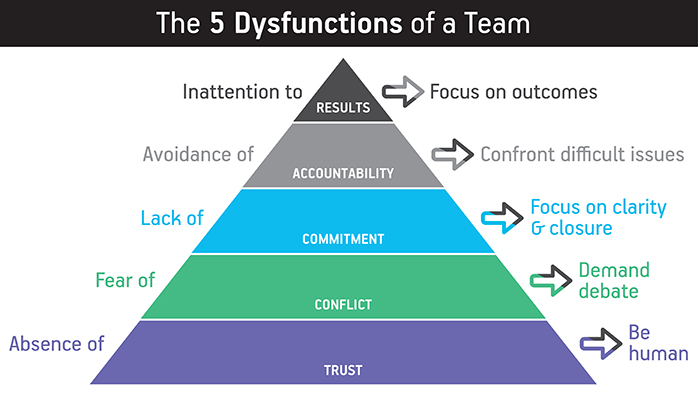

When reading the book, I had the impression that it's not only about workplace collaboration, it's the utopia we'd like
to achieve in all our society.

A place

- You could comfortably expose your vulnerability, knowing that it won't be leveraged against you but earning mutual
  trust
- You could raise your point not fearing conflicts with others, knowing that it's all for the sake of revealing all the
  known facts and thoughts
- Everyone could confidently commit to a shared goal because all the views have been shared. Even consensus is hard to
  achieve due to natural individual difference, a commit is a commit so everyone could move on
- You could safely point out other's fault especially lack of respect for the commit, because both know it's not
  personally and only for the good of whole team. Meanwhile, when you're pointed out, you feel grateful for the safety
  net
- If some of you are in the same group, sharing the same goal, only the collective results matter. No one's action is
  stemmed from *sole* personal interest, especially the demonstration of own value

At least, I won't expect less from a true friend. Maybe that's what we are after in our daily life.

That's all the book is about, and I highly recommend a read of that, so you could find or make your comrades striving
for a more enjoyable environment.

## Appendix

The diagram that showcase the layered dysfunctions

### A discussion on the example for top dysfunction

In the book, the author used an example as the dysfunction of inattention to results. One of the character joined the
company with the expectation to nurture his COO career. When the sales director quit, he had to volunteer to take that
role. Although in the end they found a replacement and the guy resumed his COO role, it's not super clear that when this
kind of personal interest having conflict with team's benefit, including career, skill growth, hobbies, lives, should
the personal ones always be sacrificed.

My view is, individual should no longer be seemed as subordinate to a "bigger" organisation. If the team tends to go
farther, all the individuals should be respected and their benefit is one of the missions of the organisation. It's fair
to make short term sacrifice to help the boat sailing, yet it won't be sustainable if personal interest is ignored. The
solution is again the transparency, so one has the willingness to expose personal desire believing that it's fine to be
a normal person.

This might be my only concern with the book though I believe it's just for the brevity of the narrative. 

