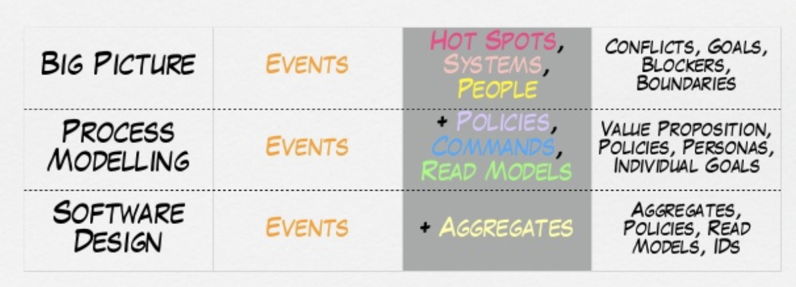
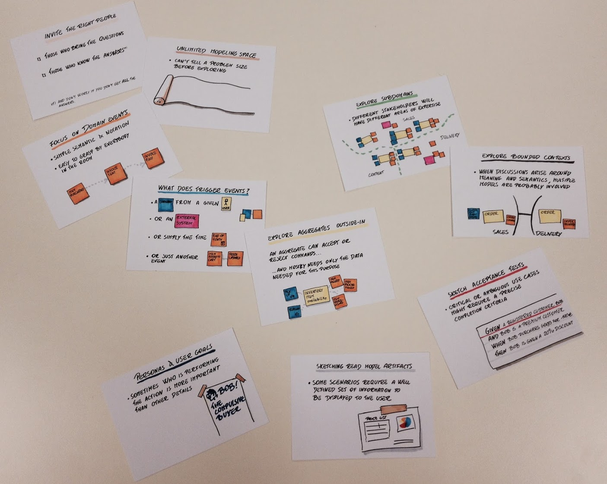

You may have heard of Event Storming before, or maybe not. Yet today is the first time I kinda have a grasp of what that amazing tool is about. What’s more, we practiced that on a [user story kata](https://github.com/codurance/apprenticeship/wiki/DDD-Exercise_Acme-Library) and the process evoked a lot of thinking inside me. I’m going to mix original references, excerpts and my understanding into this blog.

## Definition of Event Storming
Basically, it’s about groups of people sticking lots of post-its on a big wall/white board/papers. It’s a tool to reveal the domain knowledge, and is more business oriented instead of technical oriented. It has several variations so you can’t find a definitive way to do that. Yet all agreed that it should start with posting Domain Events.

It’s invented by  Alberto Brandolini and introduced in [this blog](http://ziobrando.blogspot.com/2013/11/introducing-event-storming.html). Interestingly this blog didn’t place a definition on what Domain Events, Aggregates are at all. Its focus was on how to apply the tool pragmatically. S
o I assume at the beginning Brandolini’s intention was to use that on DDD, and all terms should be a subset of DDD. It mentioned one key process, which was starting with domain events, then find source of events - commands, and at last aggregates.

This picture is from one in the deck of Brandolini. It well explained what to cover in different level of Event Storming.

## What’s the purpose of Event Storming
For me, again, it’s business oriented. I don’t think it will help much to reveal a mature DDD design, even if you pointed out some aggregates on the wall. Those bounded context may be consistent with implementation, but what’s gonna be the real Domain Events and Aggregates in implementation, that question is not resolved in this tool.

Yet you can efficiently use it to expose domain knowledge within the team, and align all people involved. Also the different Ubiquitous Languages used during the process may be a strong proof of necessities of separate Bounded Contexts.

Also, it’s mentioned in the original blog from Brandolini that "Embracing incompleteness will make the workshop less boring and more fruitful.”. I fully agree on that. Exhaustiveness is not a requirement, it can always be iteratively improved. Or just jump into coding and find out what’s feasible.

## What people you want for the Storming
Right people. It depends on what level you plan to storm. Make sure all invited people have something to contribute. You want domain experts definitely, also developers and QAs, BAs etc.

"This group will likely be a mixture of stakeholders representing user experience, business, architecture, development, and IT.” If it’s high level, cross functional, get domain experts from different teams and do that together.

## Some practical thinking

### What’re Domain Events here
It just doesn’t matter. Simply ask all attendees to think about events could happen in business. Some events may look like Command, but that’s also fine. One Event from previous process could be the cause of Command for next process. Just post it. Reveal more domain knowledge.

### What Could be the source of Events
May be:
1. Commands From an actor
2. Commands From an external system
3. Caused by some condition like time
4. From other events

### What’re Aggregates here
For now I don’t see the points to have Aggregates in Event Storming since it’s not helping anything at all.

## References
https://github.com/wwerner/event-storming-cheatsheet#execution

It covers two more things after aggregates: boundaries and views. It also provides some naming of events and commands. Yet it explains no reasoning behind all steps. Cheatsheet is really a proper name.
Sequence: Event → Command → Aggregate → boundaries → view

https://www.slideshare.net/ziobrando/model-storming

Not sure what’s it about. Find out yourself.

https://www.slideshare.net/ziobrando/50000-orange-stickies-later

Very nice, good examples and well explained

https://mural.co/

The nice online collaboration website we used to draw the Event Storming. $12/20 per member/month.
